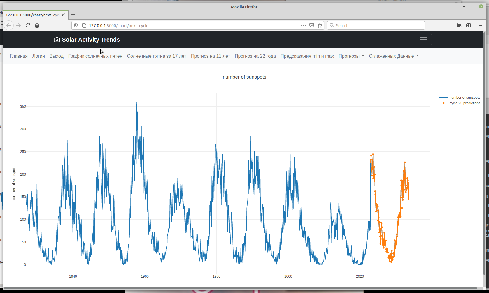

# Flask-приложение solar trends prediction
Solar trends prediction

## Подготовка к запуску:
- Перед запуском необходимо установить дополнительные модули для python: pip3 install -r requirements
- Необходимо создать SQLite db (файл webapp.db) для нашего веб-приложения: python3 create_db.py
- Создание пользователей перед запуском: python3 create_admin.py
- Перед запуском необходимо загрузить данные в базу с помощью скрипта: ./load_data.sh

## Запуск веб-приложения:
- Для Windows: set FLASK_APP=webapp && set FLASK_ENV=development && set FLASK_DEBUG=1 && flask run

- Для Unix/Mac: ./run_webapp.sh или
export FLASK_APP=webapp && export FLASK_ENV=development && export FLASK_DEBUG=1 && flask run

## Меню веб-приложения:
- Главная страница
- Логин
- Выход
- График солнечных пятен
- Солнечные пятна за 17 лет
- Прогноз на 11 лет
- Прогноз на 22 года
- Предсказания min и max
- Сглаженных Данные

## Пример прогноза на 11 лет

# Sqlite db url
SQLALCHEMY_DATABASE_URI = "sqlite:///~/git/solar_trends_prediction/webapp.db"
# PostreSQL db url
SQLALCHEMY_DATABASE_URI = "postgresql://%(DB_USER)s:%(DB_PASS)s@%(DB_HOST)s:5432/%(DB_NAME)s"

## End

